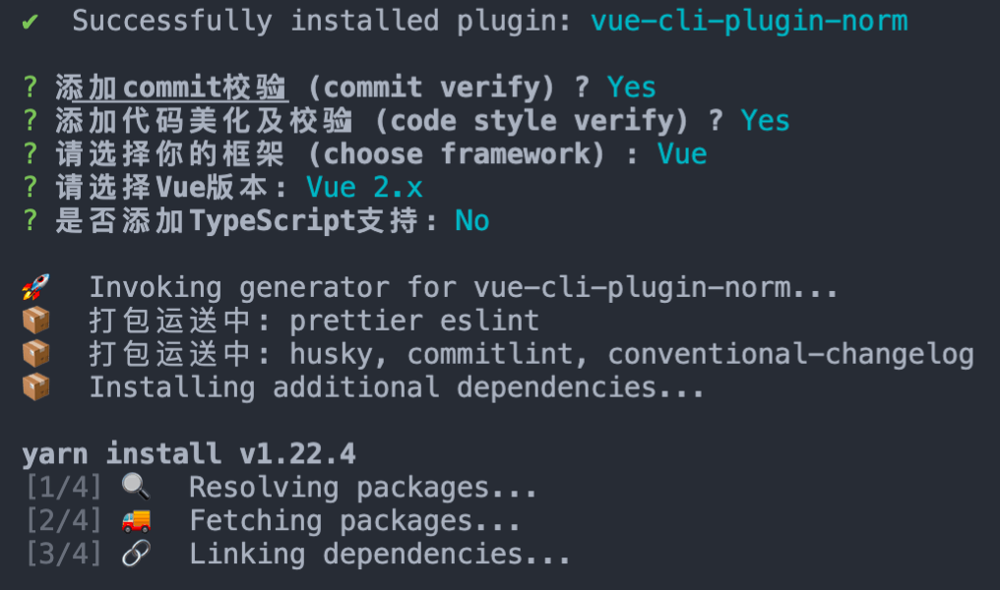
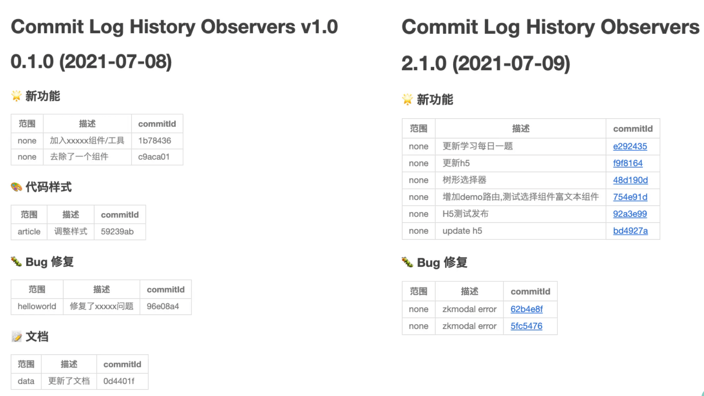

# vue-cli-plugin-norm
Code style and validation, git commit specification, for Vue/React, Fully automated!

  <a href="https://www.npmjs.org/package/vue-cli-plugin-norm">
    
  </a>

  <a href="https://npmcharts.com/compare/vue-cli-plugin-norm?minimal=true">
    
  </a>

English / [简体中文](./README.zh-CN.md)

### Your vscode need to install plugin：`prettier` `eslint`

warn: It is best not to add TS-lint to Vue2/3, little bit strange.

### Currently rely on Vue-cli
```
npm install -g @vue/cli
# OR
yarn global add @vue/cli
```

### At your project: 
```
vue add vue-cli-plugin-norm
```


### Start, enjoy code!

new commit: 
```
npm run c / npm run commit
``` 


commit log view: 
```
npm run clog
```


alloyteam's Doc : [ESlint reference Doc.](https://alloyteam.github.io/eslint-config-alloy/?hideOff=1)

### How to uninstall

```
yarn remove commitizen commitlint conventional-changelog-cli husky right-pad

yarn remove babel-eslint eslint eslint-plugin-vue vue-eslint-parser eslint-config-alloy
```
delete `commitlint.config.js` `.eslintrc.js` `.prettierrc.js` at your root directory.